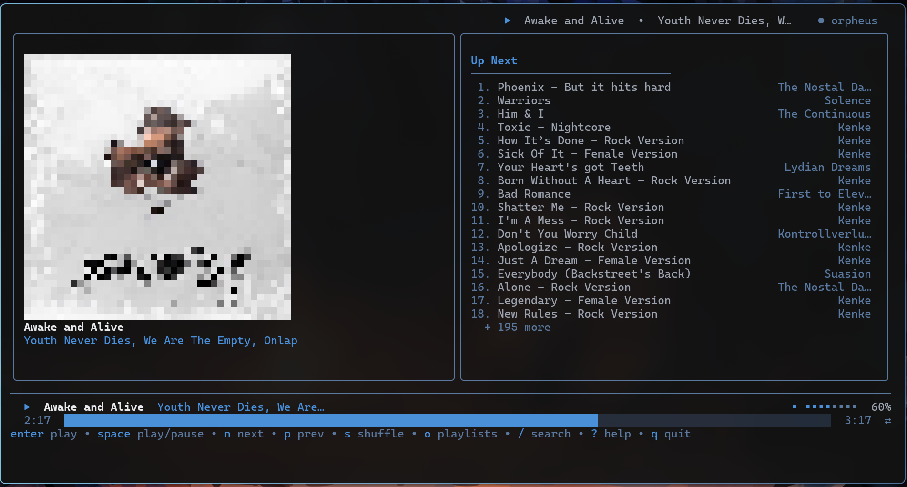

# orpheus

- This code is turboshit
- This is a just a concept still, it is quite working but its slow and the UI is experimental to say the least
- I will improve this later, but for now, it is what it is
- Probably sometime instead of copying implementation from go-librespot i will fork it and make it a library and use it -> What I did was extract the internal from it and, instead of using its daemon, wrapping it in the TUI directly

### Preview

- Currently this is the UI of orpheus (which will probably change a lot given time)

