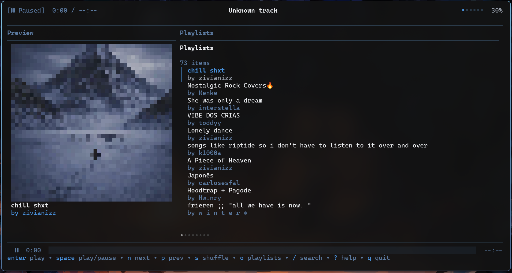
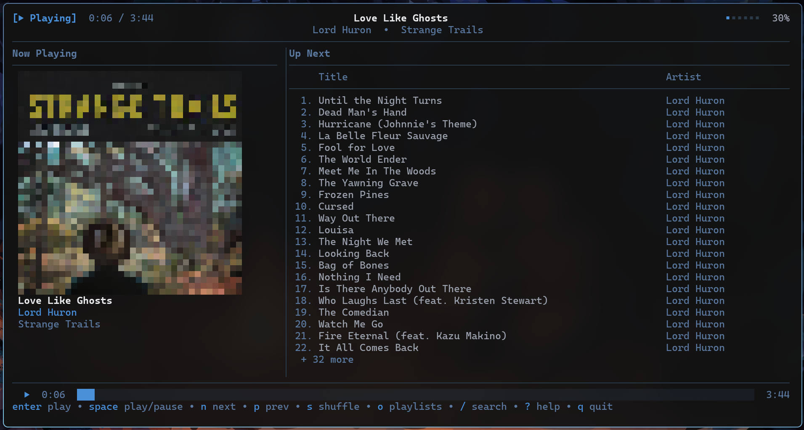

# orpheus

- This code is (kinda, not so) turboshit

### Preview

- TUI is improved but still has a long way to go

### Notes

- Probably sometime instead of copying implementation from go-librespot i will fork it and make it a library and use it -> What I did was extract the internal from it and, instead of using its daemon, wrapping it in the TUI directly

>Already started making changes to the go-librespot to fit orpheus use case, expected to try and migrate everything on the end of the week if the implementation is good enough
