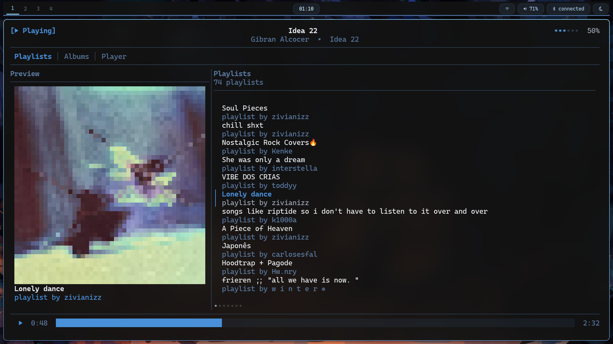
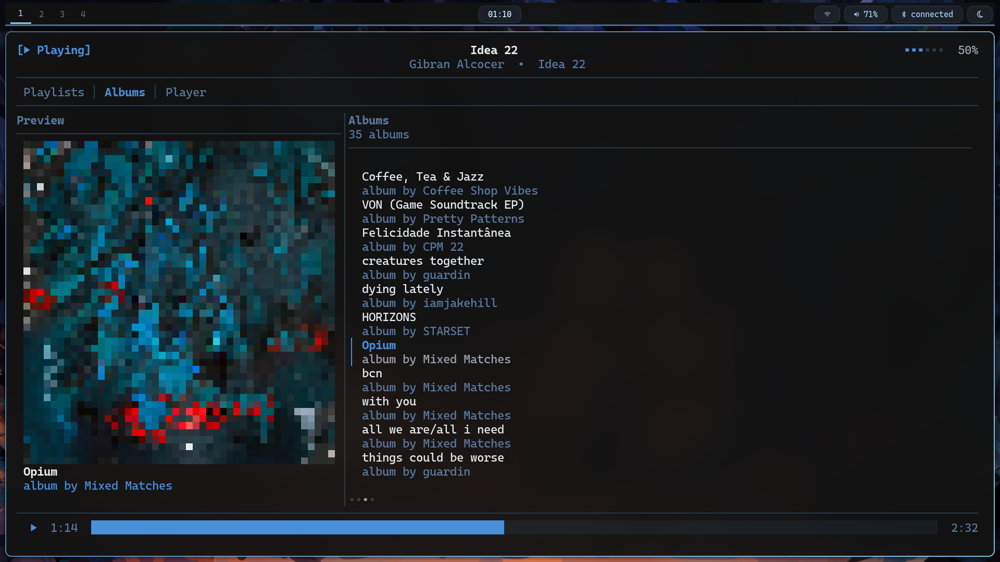
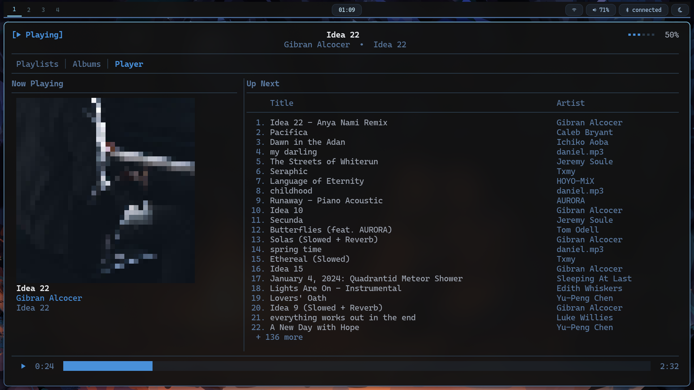

# orpheus

>Orpheus is a terminal music player for spotify, which was created only because I wanted a spotify TUI player that looked the way I wanted 

- The code is not so shit anymore, but surely could be better

- A lot of errors are still being fixed but you can use it if you really want to

### Preview

- As you can see TUI was heavily inspired by the RMPC project, the tabs being the main point of the inspirations as well as the minimalist yet clean design

- I will eventually add more UI designs and configurations (but probably wont be customizable)

### Thanks!

- A big shoutout to the [guy](https://github.com/devgianlu) that developed [go-librespot](https://github.com/devgianlu/go-librespot), this wouldnt be possible if it wasnt for his port of librespot to go
- Another big shoutout to the [guy](https://github.com/mierak) that created [RMPC](https://github.com/mierak/rmpc) for making such a good looking UI and great app that inspired not only my interface but my will to make one myself
