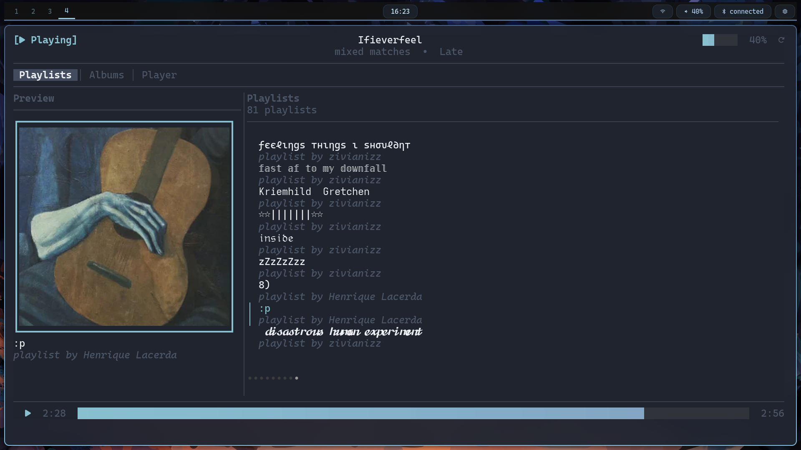
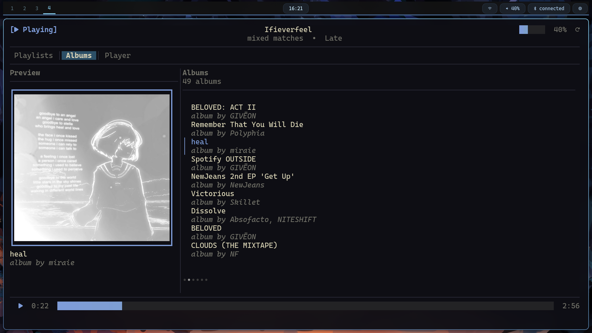
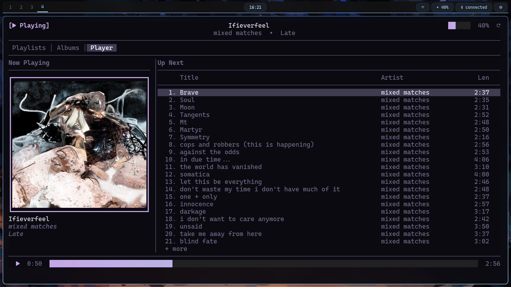

# orpheus

>Orpheus is a terminal music player for spotify, which was created only because I wanted a spotify TUI player that looked the way I wanted

- [See tutorial for initial configuration](tutorial.md) and [configuration documentation](docs/config.md) for more details

### Notes

**A terminal that supports kitty image protocol is needed to display non pixelated art (prints were taken in [ghostty](https://github.com/ghostty-org/ghostty))**

- The code is not so shit anymore, but surely could be better

- A lot of errors are being fixed constantly but you can use it if you really want to

### Preview

- As you can see TUI was heavily inspired by the RMPC project, the tabs being the main point of the inspirations as well as the minimalist yet clean design

### Features

| Feature | Description | Keybind |
| --- | --- | --- |
| **Playback** | | |
| Play / pause | toggle the current track | `space` |
| Next / previous | skip or go back | `n` / `p` |
| Seek | jump 5 seconds | `←` / `→` |
| Volume | step the volume up / down | `+` / `-` |
| Shuffle | shuffle the current context | `s` |
| Repeat | cycle repeat: off → context → track | `l` |
| Spotify Connect | the player shows up in Spotify's device picker, control it from your phone too | — |
| **Library** | | |
| Tabs | playlists, albums and the player screen | `tab` |
| Liked songs | your saved tracks as a built-in playlist | — |
| Track popup | open every track of a playlist / album | `space` on a row |
| Search filter | filter the list as you type | `/` |
| Select / play | enter a playlist or play the selection | `enter` |
| Refresh library | reload playlists / albums | `r` |
| **Queue** | | |
| Queue panel | upcoming tracks with durations and the now-playing marker | `↑` / `↓` to browse |
| Play from queue | start any row | `enter` |
| Remove row | drop a track from the queue | `x` |
| Reorder | move a row up / down | `[` / `]` |
| Auto top-up | when the queue runs out, the rest of the playlist is pulled in | — |
| **Setup & settings** | | |
| Settings | crossfade, audio cache, theme, keybinds | `o` |
| Custom keybinds | change every keybind from the settings modal, saved to disk | — |
| Theming | 11 presets plus full customization: colors, backgrounds, glyphs, typography, covers ([theming](docs/theming.md)) | — |
| Help | every keybind, live from your config | `?` |
| Quit | `ctrl+c` always works too | `q` |
| **Under the hood** | | |
| Streaming playback | real spotify streaming via go-librespot: prefetch and gapless between tracks | — |
| Crossfade & audio cache | optional, configured in settings or the config files | — |
| Cover art | kitty image protocol with a fallback for other terminals | — |
| Config files | everything persists to plain files you can edit ([configuration](docs/config.md)) | — |

Every keybind can be changed in settings (`o` → Keybinds).

### Thanks

- A big shoutout to the [guy](https://github.com/devgianlu) that developed [go-librespot](https://github.com/devgianlu/go-librespot), this wouldnt be possible if it wasnt for his port of librespot to go
- Another big shoutout to the [guy](https://github.com/mierak) that created [RMPC](https://github.com/mierak/rmpc) for making such a good looking UI and great app that inspired not only my interface but my will to make one myself
