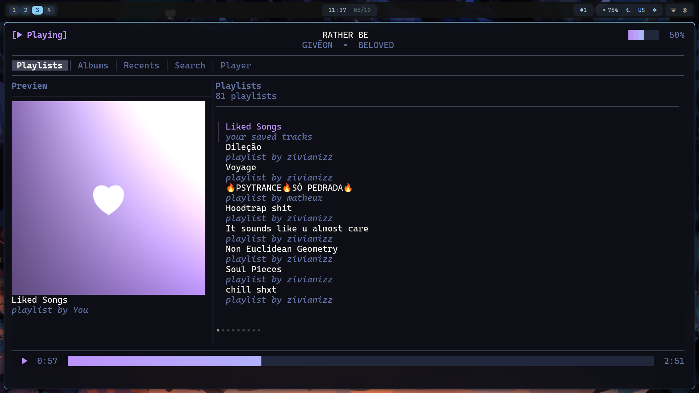
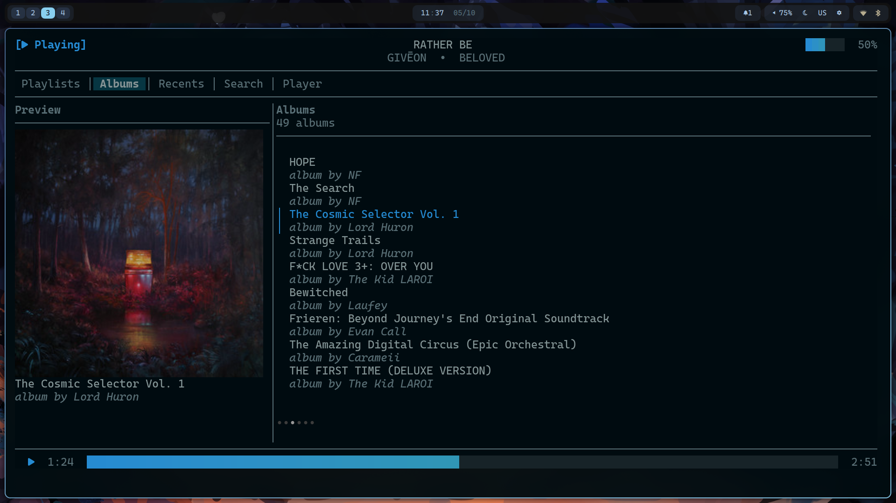
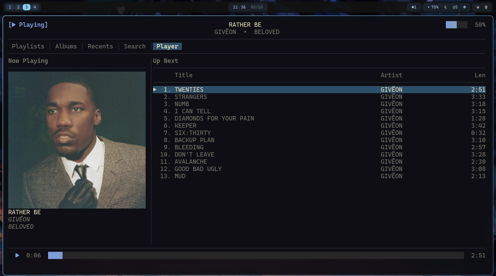

# orpheus

>Orpheus is a terminal music player for spotify, which was created only because I wanted a spotify TUI player that looked the way I wanted

- [See tutorial for initial configuration](tutorial.md) and [configuration documentation](docs/config.md) for more details

### Install

Prebuilt binaries are published for Linux (x86_64) and macOS (arm64):

```sh
curl -fsSL https://raw.githubusercontent.com/Cabritto-Corps/orpheus/main/install.sh | bash
```

The installer verifies the release SHA-256 checksum, installs the binary to `~/.local/bin`, adds that directory to your shell startup file when needed, and seeds starter `config.json`, `theme.json`, `keys.json`, and `.env` files under `~/.config/orpheus` without overwriting existing files. Useful options:

- `bash -s -- --bin-dir <dir>` to choose another directory
- `bash -s -- --version vX.Y.Z` to pin a release
- `bash -s -- --install-deps` to install missing audio libraries with your distro package manager
- `bash -s -- --flac-flavor <flac8|flac12|flac14>` to override the automatic audio-library flavor pick (see below)
- `bash -s -- --no-config` to skip starter configuration files

#### Audio library flavors

Linux binaries ship in three flavors, one per FLAC version your distro provides (`ldconfig -p | grep libFLAC` tells you yours). The installer picks automatically:

| Flavor | Needs | Typical distros |
| --- | --- | --- |
| `flac8` | `libFLAC.so.8` (FLAC 1.3.x) | Ubuntu ≤ 22.04, Debian ≤ bullseye, Mint 21 |
| `flac12` | `libFLAC.so.12` (FLAC 1.4.x) | Ubuntu 24.04+, Debian bookworm+, Mint 22 |
| `flac14` | `libFLAC.so.14` (FLAC 1.5.x) | Arch / EndeavourOS / CachyOS, Debian trixie+ |

Downloading by hand? Grab `orpheus-linux-amd64-<flavor>.tar.gz` from the [releases page](https://github.com/Cabritto-Corps/orpheus/releases/latest). macOS has a single `orpheus-darwin-arm64.tar.gz` (no flavors).

On Linux, missing ALSA/FLAC/Ogg/Vorbis libraries are detected with `ldd` and the installer prints the exact distro command (or runs it with explicit consent). macOS needs `brew install libogg libvorbis flac`. Then run `orpheus auth login` (requires Spotify Premium).

### Notes

**A terminal that supports kitty image protocol is needed to display non pixelated art (prints were taken in [ghostty](https://github.com/ghostty-org/ghostty))**

- The code is not so shit anymore, but surely is improving

- A lot of errors are being fixed constantly but its quite stable, so you can use it if you want to

### Preview

- As you can see TUI was heavily inspired by the RMPC project, the tabs being the main point of the inspirations as well as the minimalist yet clean design





### Features

| Feature | Description | Keybind |
| --- | --- | --- |
| **Playback** | | |
| Play / pause | toggle the current track | `space` |
| Next / previous | skip or go back | `n` / `p` |
| Seek | jump 5 seconds | `←` / `→` |
| Volume | step the volume up / down | `+` / `-` |
| Shuffle | shuffle the current context | `s` |
| Repeat | cycle repeat: off → context → track | `l` |
| Spotify Connect | the player shows up in Spotify's device picker, control it from your phone too | — |
| **Library** | | |
| Tabs | songs, playlists, albums, Search and Player | `tab` |
| Songs | up to 100 tracks: current, recent, saved, then playlist/album tracks; duplicates removed | — |
| Track popup | open every track of a playlist / album | `space` on a row |
| Search filter | filter the current list as you type; Songs matches title and artists | `/` |
| Spotify Search | open the Search tab for tracks, albums and artists | `ctrl+f` (also `ctrl+l` / `f3`) |
| Select / play | enter a playlist or play the selection | `enter` |
| Refresh library | reload songs, playlists and albums | `r` |
| **Queue** | | |
| Queue panel | upcoming tracks with index, artist and duration | `↑` / `↓` to browse |
| Play from queue | start any row | `enter` |
| Remove row | drop a track from the queue | `x` |
| Reorder | move a row up / down | `[` / `]` |
| Auto top-up | when the queue runs out, the rest of the playlist is pulled in | — |
| **Setup & settings** | | |
| Settings | crossfade, audio cache, theme, keybinds | `o` |
| Custom keybinds | change every keybind from the settings modal, saved to disk | — |
| Theming | 11 presets plus full customization: colors, backgrounds, glyphs, typography, covers ([theming](docs/theming.md)) | — |
| Help | every keybind, live from your config | `?` |
| Quit | `ctrl+c` always works too | `q` |
| **Under the hood** | | |
| Streaming playback | real spotify streaming via go-librespot: prefetch and gapless between tracks | — |
| Crossfade & audio cache | optional, configured in settings or the config files | — |
| Cover art | kitty image protocol with a fallback for other terminals; style is selectable in settings | — |
| Config files | everything persists to plain files you can edit ([configuration](docs/config.md)) | — |

Every keybind can be changed in settings (`o` → Keybinds).

In Search, results update as you type. Use `↑` / `↓` to browse and `enter` to play.
Playing a song in Search or Songs keeps the list open so you can choose another; albums and artists
open Player. `tab` switches tabs, and `/` focuses the search field again after `esc`.
Search and Songs thumbnails use full-resolution graphics on Kitty-compatible
terminals when Images is set to `rendered`; other terminals use pixelated ANSI art.

### Build and run locally

To work on the source instead of installing a release, install Go 1.26 or newer and the audio development libraries, then build from a clone:

```sh
git clone https://github.com/Cabritto-Corps/orpheus.git
cd orpheus
make build
```

After changing the source, rebuild and restart **`./orpheus`**. Running an older
installed `orpheus` from your PATH will not include the changes in your checkout.

Follow the [initial setup tutorial](tutorial.md) to create a Spotify app and set `SPOTIFY_CLIENT_ID` (Spotify Premium is required). Then run `./orpheus auth login` and `./orpheus`. See [CONTRIBUTING.md](CONTRIBUTING.md) for the platform-specific build dependencies, tests, and pull request workflow.

### Thanks

- A big shoutout to the [guy](https://github.com/devgianlu) that developed [go-librespot](https://github.com/devgianlu/go-librespot), this wouldnt be possible if it wasnt for his port of librespot to go
- Another big shoutout to the [guy](https://github.com/mierak) that created [RMPC](https://github.com/mierak/rmpc) for making such a good looking UI and great app that inspired not only my interface but my will to make one myself
