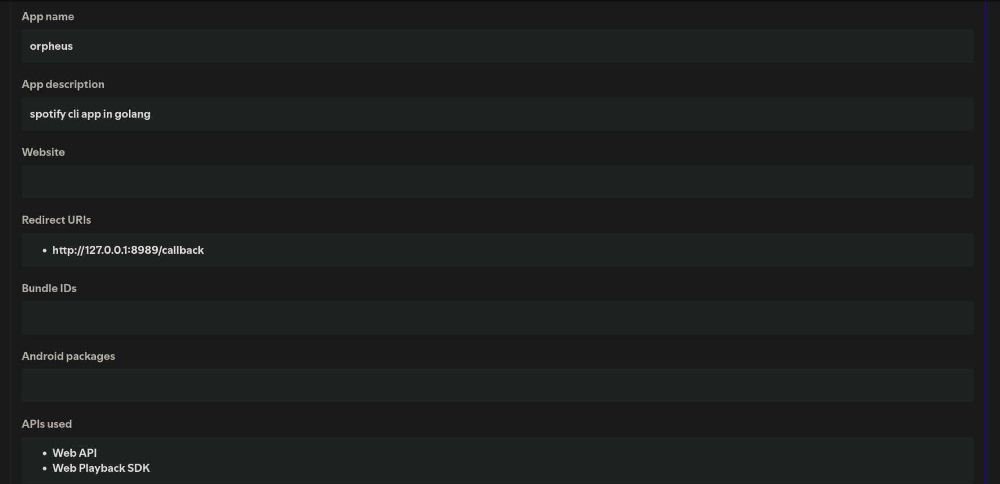
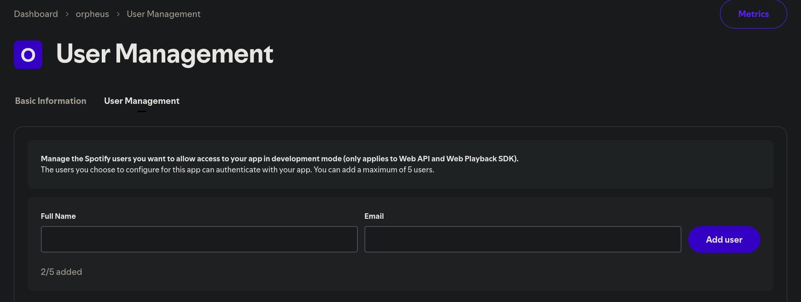

# Configuration
**You need spotify premium to configure this**

1. Download latest release from [here](https://github.com/Cabritto-Corps/orpheus/releases) or compile the source code yourself

2. Go into spotify developer dashboard and create an app with the following informations:
  - App name: *Any name you want*
  - Redirect URI: http://127.0.0.1:8989/callback
  - APIs used: WEB API, WEB Playback SDK
- image for reference:



3. Then go into user management and add yourself as a user to the app (add your spotify account email)



4. After that, copy the client ID from the basic information tab

5. Now create a .env file in the same directory as the executable and add the following line to it, replacing the client ID with your own

```bash
SPOTIFY_CLIENT_ID=your_client_id_here
```

6. Now run ```./orpheus auth login```, this will give a local link for authorization via the browser (using the client ID you just created)

7. Now just run ```./orpheus``` and it will prompt you to auth again, this is because go-librespot uses another client_id, after that you should see orpheus actual screen

8. Press `?` to see keybinds

9. Enjoy the music!
