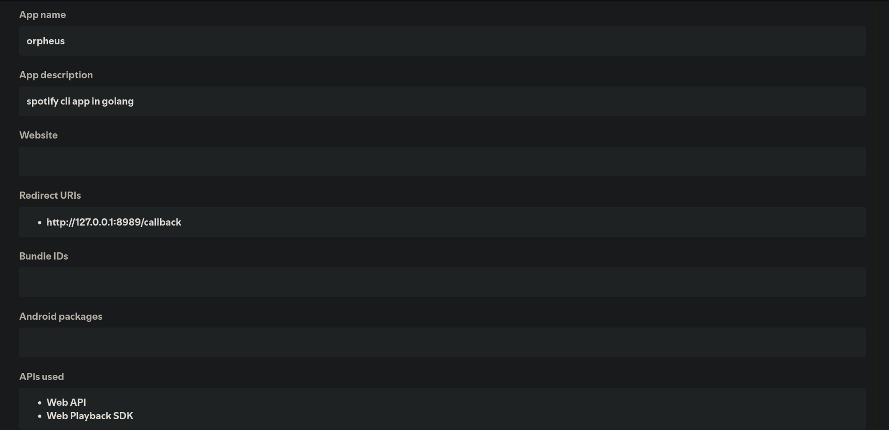
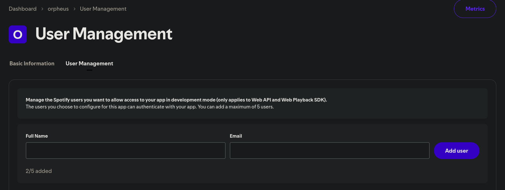

# Configuration

**You need spotify premium to configure this**

1. Download latest release from [the releases page](https://github.com/Cabritto-Corps/orpheus/releases) or compile the source code yourself. The release tarball contains a binary named `orpheus`; verify the install with `./orpheus --version`, which prints the release it was built from

2. Go into [spotify developer dashboard](https://developer.spotify.com/dashboard/) and create an app with the following informations:

- App name: *Any name you want*
- Redirect URI: <http://127.0.0.1:8989/callback>
- APIs used: WEB API, WEB Playback SDK
- image for reference:



1. Then go into user management and add yourself as a user to the app (add your spotify account email)



1. After that, copy the client ID from the basic information tab

2. Create a `.env` file containing the line below, replacing the client ID with your own. For a globally installed `orpheus` (e.g. on your `PATH`), put it at `~/.config/orpheus/.env` so it loads from any working directory. Otherwise place it next to the executable (the current directory is checked first). See [the configuration files doc](docs/config.md) for the full loading order and every available option.

```bash
SPOTIFY_CLIENT_ID=your_client_id_here
```

1. Now run ```./orpheus auth login```, this will give a local link for authorization via the browser (using the client ID you just created)

2. Now just run ```./orpheus``` and it will prompt you to auth again, this is because go-librespot uses another client_id, after that you should see orpheus actual screen

3. Press `?` to see keybinds

4. Enjoy the music!
